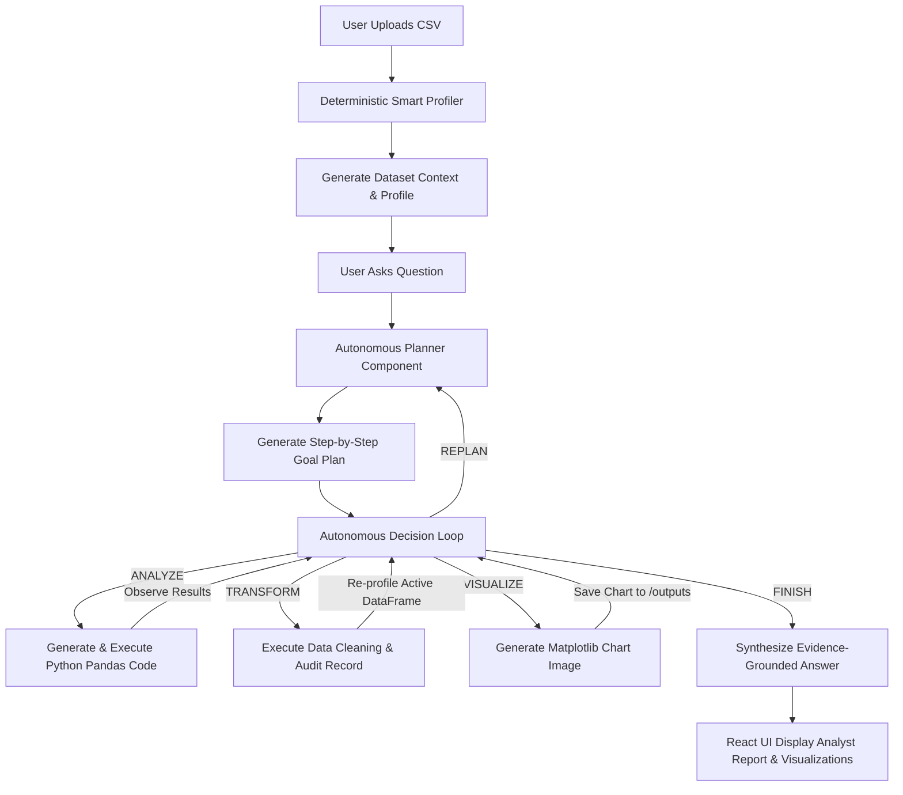

# 📊 AI Data Analyst — Agentic CSV Analytics & Reasoning Platform

An autonomous, stateful **Agentic AI Data Analyst** platform built with Python, FastAPI, Google Gemini 3.5, React, Vite, and Tailwind CSS.

Unlike traditional LLM wrappers that merely generate text responses, **AI Data Analyst** operates as an autonomous agent equipped with Python code execution, deterministic data profiling, stateful multi-turn data transformation, automated data audit logging, Matplotlib visualization generation, and self-correcting error recovery.

---

## 🌟 What Makes This Agentic?



### Key Agentic Capabilities:
1. **Deterministic Auto-Profiling**: Immediately analyzes dataset shape, data types, missing value percentages, duplicate counts, correlation matrices, and potential ID/date columns before planning.
2. **Explicit Planning**: Breaks complex analytical questions into logical execution steps prior to running code.
3. **Autonomous Action Selection**: Evaluates intermediate evidence to choose among `ANALYZE`, `TRANSFORM`, `VISUALIZE`, `REPLAN`, `EXPORT_DATA`, or `FINISH`.
4. **Stateful DataFrame Transformations**: Maintains an active working DataFrame (`active_df`) across multi-turn questions. Transformations (e.g., median missing value imputation or duplicate removal) persist for subsequent questions.
5. **Self-Correcting Error Recovery**: If generated Python code fails or violates constraints, the agent inspects the error traceback and automatically generates corrected code.
6. **Audit Trail & Data Safety**: Produces structured transformation audit records while guaranteeing that original source CSV files on disk remain 100% untouched.

---

## 🚀 Key Features

- **Upload & Auto-Profile**: Drag-and-drop any `.csv` dataset. Generates immediate row/col counts, missing data ratios, duplicate checks, and data type summaries.
- **Natural Language Data Q&A**: Ask analytical questions in plain language (*"Which region generated the highest total sales?"*, *"What is the average fare for 1st class passengers?"*).
- **Interactive Matplotlib Visualizations**: Automatically generates bar charts, histograms, scatter plots, and line graphs. View and download charts directly within the UI.
- **Interactive Recharts Column Explorer**: Dedicated UI tab to search, inspect schema, view sample values, and browse column distributions via Recharts.
- **Searchable & Paginated Data Table**: Browse raw sample dataset rows with sticky headers, numeric alignment, and muted `N/A` missing value indicators.
- **Analyst Report Formatting**: Renders structured answers with paragraphs, bold metrics, bullet lists, numbered steps, and clean Markdown tables.
- **Human-Readable Agent Activity**: Live progress checklist showing real-time agent reasoning steps (`Analyzing your data`, `Updating the dataset`, `Creating visualization`).
- **Error Recovery & Retry Controls**: Clean error UX allowing one-click retries without exposing Python stack tracebacks.

---

## 🛠️ Technology Stack

| Layer | Technology |
| :--- | :--- |
| **AI Agent & Reasoning** | Python 3.13, Google Gemini API (`gemini-3.5-flash-lite`), Pandas, NumPy |
| **Backend API** | FastAPI, Uvicorn, Pydantic, Python-Multipart |
| **Visualization** | Matplotlib (Agg backend), Recharts |
| **Frontend UI** | React 19, Vite 8, Tailwind CSS v4, Lucide React, Axios |
| **Testing** | Pytest, FastAPI TestClient, Unittest |

---

## 📁 Project Structure

```
AI-Data-Analyst/
├── backend/
│   ├── main.py              # FastAPI app, routes (/api/upload, /api/chat, /api/health)
│   ├── models/
│   │   └── schemas.py       # Pydantic schemas (UploadResponse, ChatRequest, ChatResponse)
│   ├── services/
│   │   └── session_service.py # In-memory session store & dataset state manager
│   └── utils/
│       └── chart_helper.py  # Safe chart file management & path resolution
├── src/
│   ├── agent.py             # Core Autonomous Agentic Loop & LLM interaction
│   ├── planner.py           # Planning & Decision Parser logic
│   ├── tools.py             # Execution tools (execute_analysis, execute_transformation, etc.)
│   ├── data_inspector.py    # Deterministic Smart Profiler & data type detection
│   ├── data_loader.py       # CSV loading utilities
│   ├── python_executor.py   # Isolated Python exec runner
│   └── llm.py               # Gemini client initialization
├── frontend/
│   ├── src/
│   │   ├── components/
│   │   │   ├── Header.jsx           # App header & active dataset status
│   │   │   ├── UploadScreen.jsx     # Drag-and-drop CSV upload zone
│   │   │   ├── Workspace.jsx        # Tabbed dashboard layout
│   │   │   ├── DatasetOverview.jsx  # 6 Metric Cards bar
│   │   │   ├── ColumnExplorer.jsx   # Searchable column schema explorer & Recharts
│   │   │   ├── DataPreviewTable.jsx # Paginated & searchable sample table
│   │   │   ├── ChatInterface.jsx    # Conversation view & input bar
│   │   │   ├── ChatMessage.jsx      # Analyst report formatting & chart modal
│   │   │   └── AgentActivity.jsx    # Real-time agent activity checklist
│   │   ├── services/api.js          # Axios API service
│   │   ├── App.jsx                  # Main state router
│   │   └── index.css                # Tailwind CSS imports
│   ├── package.json
│   └── vite.config.js
├── data/                    # Sample CSV datasets (sales.csv, train.csv)
├── outputs/                 # Exported cleaned CSVs & generated chart PNGs
├── tests/
│   └── test_backend.py      # Automated FastAPI backend integration tests
├── requirements.txt         # Python dependencies
└── README.md
```

---

## ⚙️ Setup & Installation

### Prerequisites
- **Python 3.10+** installed
- **Node.js v18+** & **npm** installed
- **Google Gemini API Key** (obtain from [Google AI Studio](https://aistudio.google.com/))

### 1. Environment Configuration

Create a `.env` file in the root directory:

```env
GEMINI_API_KEY=your_gemini_api_key_here
```

Create a `.env` file in `frontend/`:

```env
VITE_API_URL=http://localhost:8000
```

### 2. Backend Setup

```bash
# Create Python virtual environment
python -m venv .venv

# Activate virtual environment
# Windows:
.venv\Scripts\activate
# Linux/macOS:
source .venv/bin/activate

# Install dependencies
pip install -r requirements.txt
```

### 3. Frontend Setup

```bash
cd frontend
npm install
```

---

## 🏃 Running the Application

### Step 1: Start FastAPI Backend Server
In the root directory with `.venv` activated:

```bash
uvicorn backend.main:app --reload --port 8000
```

- API Base URL: `http://localhost:8000`
- Swagger Documentation: `http://localhost:8000/docs`
- Health Endpoint: `http://localhost:8000/api/health`

### Step 2: Start React Frontend Server
In a separate terminal, navigate to `frontend/`:

```bash
cd frontend
npm run dev
```

- Open your browser at: `http://localhost:5173`

---

## 💡 Example User Questions

### Analytical Questions
- *"What is the average sales?"*
- *"Which region generated the highest total sales?"*
- *"Which passenger class had the highest survival rate?"*

### Data Cleaning & Transformations
- *"Fill missing Age values with the median."*
- *"Remove duplicate rows from the dataset."*
- *"Convert Sales column to float."*

### Visualization Requests
- *"Compare total sales across regions and create a chart."*
- *"Show survival rate by passenger class as a bar chart."*

### Export Actions
- *"Save the cleaned dataset to CSV."*

---

## 🧪 Testing & Quality Assurance

Run the comprehensive automated test suite:

### 1. Run FastAPI Backend Integration Tests
```bash
.venv\Scripts\python.exe -m pytest tests/test_backend.py -v
```

### 2. Run Profiler & Agent Unit Tests
```bash
.venv\Scripts\python.exe src/test_profiler.py
.venv\Scripts\python.exe src/test_phase13_agent.py
```

### 3. Test Production Frontend Build
```bash
cd frontend
npm run build
```

---

## 🔒 Security & Data Integrity

- **Original Source Protection**: Uploaded source CSV files in `data/` are never overwritten or modified.
- **Isolated In-Memory DataFrame Copies**: Transformations execute strictly on working copies in memory.
- **Directory Traversal Prevention**: Chart download routes (`/api/charts/{chart_id}`) validate file paths strictly inside `outputs/`.
- **Secret Shielding**: API keys and backend Python tracebacks are stripped before sending HTTP responses.

---

## 📜 License

Distributed under the MIT License. See `LICENSE` for more information.
